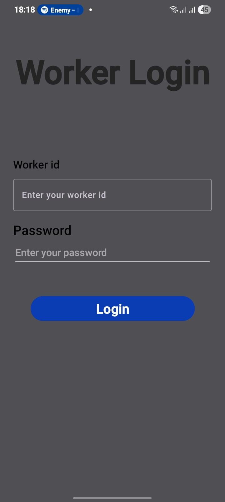
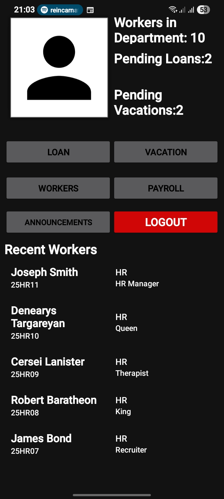
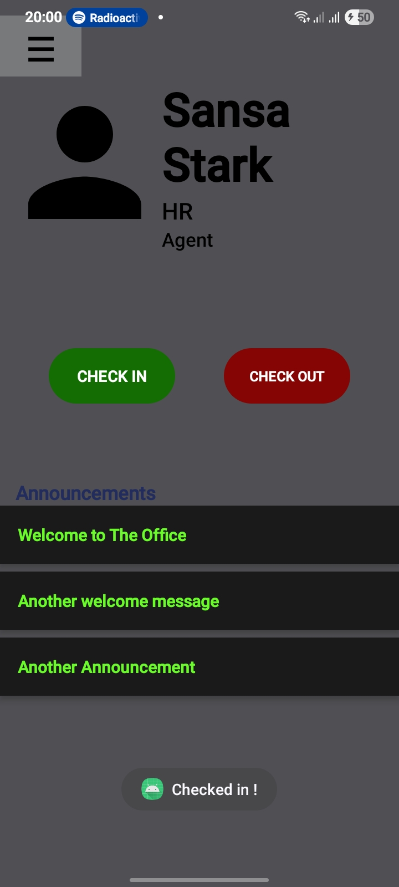
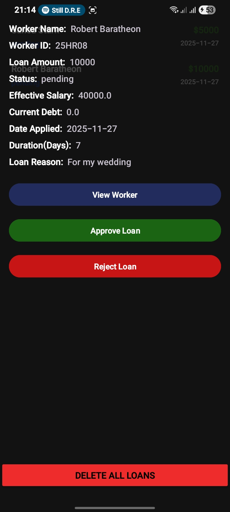
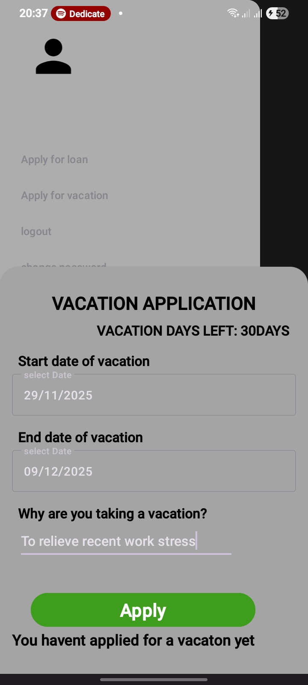
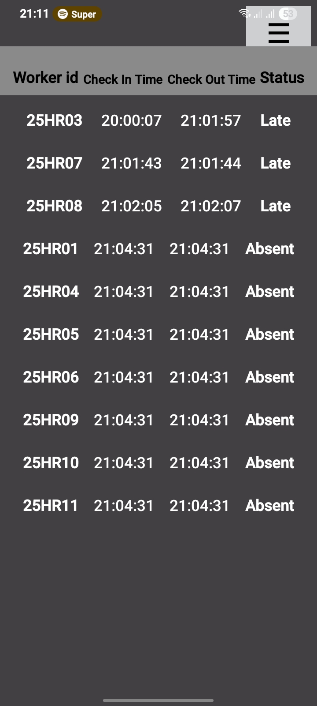
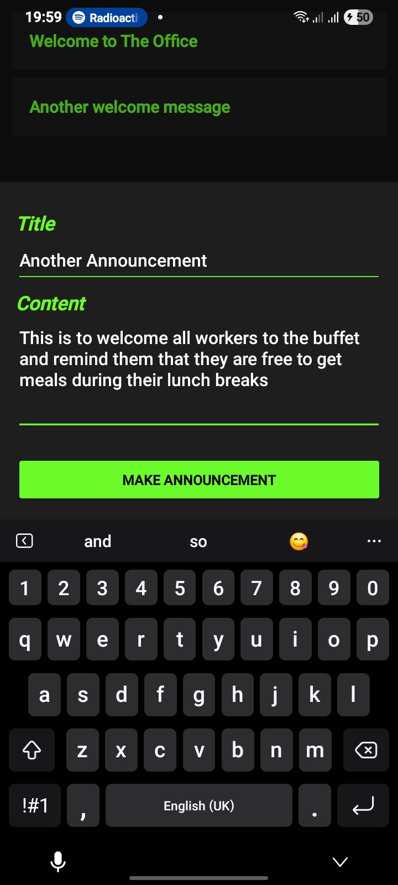

# ERP Project – Android Application


---


## Overview


This project is a comprehensive **Enterprise Resource Planning (ERP)** Android app built using **Java** in **Android Studio**.  
It simulates a realistic administrative and worker workflow, including attendance tracking, loans, vacations, and announcements.


---
---


## Screenshots


### 1. Login Screen

  
Login page for admin and worker access.


### 2. Admin Dashboard

Overview of admin functionalities: loans, vacations, attendance, announcements.


### 3. Worker Dashboard
  
Worker view showing check-in,check-out,Announcements and basic worker details.


### 4. Loan Module

Admin view of pending loans with approve/reject actions.


### 5. Vacation Module

Worker Vacation Application form.


### 6. Attendance Module

Admin daily attendance list Showing workers marked absent.


### 7. Announcements Module

Admin creating a new department announcement via BottomSheet. Form is interactive,Existing announcements are displayed above for context.


## Features


### Worker Module
- View personal details:
    - Name, Role, Department
    - Attendance metrics (check-in, check-out, late/absent points)
    - Loans and vacation records
    - Attendance score (aggregate metric)
- Check-in functionality with **late status detection** after a defined cut-off time.
- View last loan and vacation approval/rejection.


### Loan Module
**Admin can:**
- View pending loans per department
- Approve or reject loans


**Worker can:**
- View loan status
- See effective salary, debt, and historical loans


**Notes:**
- Loans are represented using `LoanViewClass` combining **Loan**, **Worker**, and **Salary** data objects.


### Vacation Module
- Admin can approve/reject vacation requests.
- Tracks:
    - Days remaining
    - Vacation duration
    - Last leave date
- Worker view updates automatically on approvals.
- Automated logic for managing **active → approved** vacation status.


### Attendance Module
**Admin can:**
- View daily attendance
- Mark absent for workers who haven’t checked in


**Worker:**
- Check-ins automatically update attendance records


**Attendance scoring system:**
- Present = 1 point
- Late = 0.5 points
- Absent = 0 points


- Attendance score visible in worker details.


### Announcements
**Admin can:**
- Create announcements (title & content)
- View their past announcements


**Workers can:**
- View department-specific announcements
- Tap an announcement to see full details


---


## Architecture & Design


- **MVVM Pattern**:
    - **Repository:** Handles all database queries
    - **ViewModel:** Connects repository to UI, exposes LiveData for reactive updates
    - **Fragments / Activities:** Handles UI interactions
- **Room Database** for local persistence
- **AsyncListDiffer** and **DiffUtil** used in RecyclerViews for efficient list updates
- **BottomSheets** used for creating new entries (loans, vacations, announcements)
- **ExecutorService** for background thread operations to avoid blocking UI


---


## Technologies Used


- Java
- Android Studio
- Room Database
- LiveData & ViewModel
- ConstraintLayout & RecyclerView
- AsyncListDiffer & DiffUtil


---


## Installation


```bash
# Clone the repository
git clone <repo-url>


# Open in Android Studio
Open Android Studio -> File -> Open -> select project folder


# Build & Run
Run on emulator or physical device


---


Usage


1. Launch the app on a device/emulator.


2. Navigate between admin and worker dashboards.


3. Admin can approve loans, vacations, mark attendance, and create announcements.


4. Worker can check-in, view personal metrics, and see announcements.


5. All updates reflect in real-time using LiveData observables.


---


Project Structure


com.example.erpproject
│
├── Admin
│   ├── Activities
│   ├── Adapters
│   ├── BottomSheets
│   ├── Fragments
│   └── ViewClasses
│
├── Announcements
│   ├── AnnouncementAdapter
│   └── AnnouncementsDetailsFragment
│
├── Worker
│   ├── Activities
│   └── BottomSheets
│
├── Data
│   ├── DAO
│   ├── Database
│   └── Entity
│
├── Repository
│   ├── AnnouncementRepository
│   ├── AttendanceRepository
│   ├── LoanRepository
│   ├── VacationRepository
│   └── WorkerRepository
│
├── ViewModel
│   ├── AnnouncementViewModel
│   ├── AttendanceViewModel
│   ├── LoanViewModel
│   ├── VacationViewModel
│   └── WorkerViewModel
│
├── Utils
│
└── MainActivity


> Modules are organized by responsibility (Admin, Worker, Data, Utils).
Shared modules like announcements reside in a shared package accessible by both Admin and Worker.


---


Contributing


1. Fork the repository


2. Create a new branch:


git checkout -b feature/YourFeature


3. Make changes


4. Commit changes:


git commit -m "Add some feature"


5. Push branch:


git push origin feature/YourFeature


6. Open a Pull Request


---


License


This project is released under the MIT License – see LICENSE for details.


---


Author


Joseph Olumeyan – Full-stack Android Developer


---


